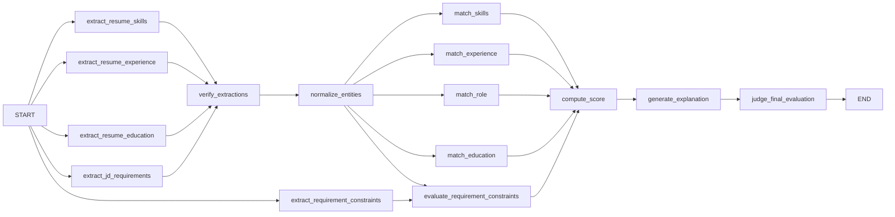
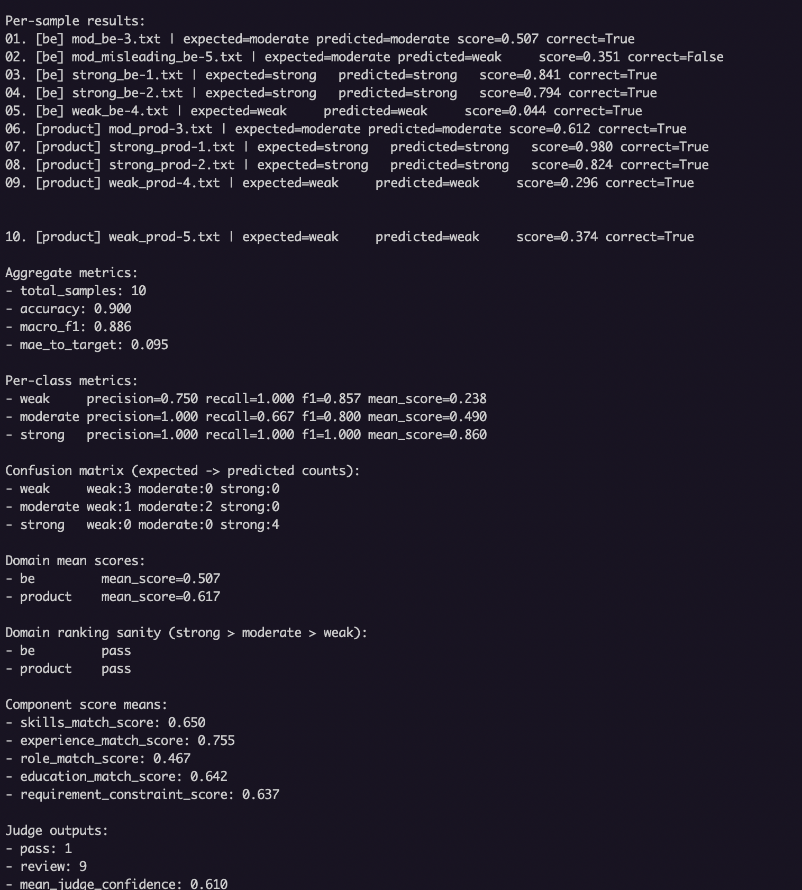

# ATS Analyser

Backend service that ingests job applications (resume uploads), scores them against a stored job description using a **LangGraph** workflow backed by OpenAI, and persists results in **MySQL**. Work is dispatched asynchronously through **SQS** (ElasticMQ in local/Docker).

## Overview

- **HTTP API (FastAPI + Granian)** — Create job postings, submit applications with a resume file, and list applications with scores and reasoning.
- **Queue consumer** — Pulls processing jobs from SQS, runs the ATS evaluation graph, and updates each application’s `relevance_score`, structured `reasoning`, and `processing_status`.
- **Data** — Resumes and job descriptions live in the database; the graph receives plain text derived from the resume bytes and the job’s position/description.

Interactive API docs: `http://localhost:8001/docs` (when the API is running).

## Agent flow (LangGraph)

Disclaimer: This entire flow is a PoC and built on some resumes I have on hand and synthetic ones generated via ChatGPT. There will definitely be gaps discovered in real world use cases and tweaks and changes that may be required. This is definitely not an all-encompassing solution but rather an exploration of how a simple system for this use case can be built.

The evaluation graph is built in `src/agents/ats_processor_agent.py` and invoked from `AtsMatchInferenceService` with `resume_text` and `jd_text`.



1. **Parallel extraction** — From `START`, the graph extracts resume skills/experience/education, JD requirements, and requirement constraints.
2. **Verify & normalize** — `verify_extractions` prunes unsupported extraction items (LLM second pass), then `normalize_entities` standardizes tokens for matching.
3. **Parallel matching** — `match_skills`, `match_experience`, `match_role`, `match_education`, and `evaluate_requirement_constraints` run in parallel to produce component scores.
4. **Score → explanation → judge** — `compute_score` blends component scores into `final_score`; `generate_explanation` creates strengths/weaknesses; `judge_final_evaluation` emits `judge_verdict`, `judge_confidence`, and `judge_notes`.

**Runtime path:** creating an application via the API enqueues a message (`application_id`, `job_description_id`). The consumer loads the resume text and JD text from the database, runs `graph.ainvoke(...)`, then saves `relevance_score` (from `final_score`) and the full JSON reasoning (including `judge_verdict`/`judge_confidence`) on the application row.

## Prerequisites

- **Python 3.12**
- **Poetry** (`pip install poetry` or see [Poetry docs](https://python-poetry.org/docs/#installation))
- For local runs without the full Compose stack: **Docker** (recommended) to run only MySQL and ElasticMQ, or your own MySQL + SQS-compatible endpoint.

## Configuration

The app reads environment variables via `src/config/env_vars.py` (and `python-dotenv` for a local `.env` file unless `PYTHON_DOTENV_DISABLED=1`).

| Variable | Purpose |
|----------|---------|
| `MYSQL_DB_HOST`, `MYSQL_DB_PORT`, `MYSQL_DB_DATABASE`, `MYSQL_DB_USER`, `MYSQL_DB_PASS` | MySQL connection |
| `MYSQL_DB_POOL_SIZE`, `MYSQL_DB_MAX_OVERFLOW` | Optional pool tuning (defaults exist) |
| `OPENAI_API_KEY`, `OPENAI_API_BASE`, `OPENAI_API_VERSION`, `OPENAI_API_MODEL`, `OPENAI_API_MODEL_VERSION` | OpenAI-compatible LLM used by the graph |
| `SQS_ENDPOINT_URL`, `SQS_QUEUE_NAME` | SQS API endpoint and queue name (queue URL is derived as `{endpoint}/{queue_name}`) |
| `AWS_ACCESS_KEY_ID`, `AWS_SECRET_ACCESS_KEY`, `AWS_REGION` | Used by SQS clients (dummy values are fine for ElasticMQ) |

Replace placeholder OpenAI values with a real key and model settings when you want actual LLM scoring (the bundled `docker-compose.yml` uses dummy values for offline bring-up).

## Run locally (Poetry)

1. **Install dependencies**

   ```bash
   cd ats-analyser
   poetry install
   ```

2. **Start MySQL and ElasticMQ** (example: only those services from Compose)

   ```bash
   docker compose up -d mysql elasticmq
   ```

3. **Create a `.env`** in the project root with at least the variables in the table above. For the default Compose ports:

   - `MYSQL_DB_HOST=127.0.0.1`
   - `MYSQL_DB_PORT=3306`
   - `MYSQL_DB_DATABASE=ats_analyser`
   - `MYSQL_DB_USER=root`
   - `MYSQL_DB_PASS=root`
   - `SQS_ENDPOINT_URL=http://127.0.0.1:9324`
   - `SQS_QUEUE_NAME=ats-processor-queue`
   - Set `OPENAI_*` to your real credentials if you are calling OpenAI.

4. **Apply migrations and create the queue**

   ```bash
   poetry run alembic upgrade head
   poetry run python -m src.startup_scripts.create_sqs_queues
   ```

5. **Run the API** (one terminal)

   ```bash
   SERVICE=api sh start.sh
   ```

6. **Run the consumer** (another terminal; required for applications to finish processing)

   ```bash
   SERVICE=consumer sh start.sh
   ```

Health check: `GET http://localhost:8001/public/v1/isup/health`

## Run with Docker

From the repository root:

```bash
docker compose up --build
```

This starts:

| Service | Role |
|---------|------|
| `api` | Migrations, SQS queue creation, then Granian on port **8001** |
| `consumer` | SQS worker that runs the ATS graph |
| `mysql` | MySQL 8 on port **3306** (data in a named volume) |
| `elasticmq` | SQS-compatible broker on **9324** / **9325** |

Compose sets `PYTHON_DOTENV_DISABLED=1` and injects environment variables directly. Override `OPENAI_API_KEY` (and related `OPENAI_*` values) for real inference, for example:

```bash
OPENAI_API_KEY=sk-... docker compose up --build
```

Or use a Compose `env_file` / host environment as you prefer.

## Project layout (short)

- `src/app.py` — FastAPI application
- `src/agents/` — LangGraph workflow and node implementations
- `src/consumers/` — SQS consumer → `AtsMatchInferenceService`
- `src/routers/` — HTTP routes (`/v1/job-posting`, `/v1/{job_id}/application`, health)
- `src/migrations/` — Alembic migrations
- `start.sh` — Entrypoint used by the Docker image (migrations, queue setup, then API or consumer based on `SERVICE`)

## Evaluation

Example run output:



This evaluation is driven by `src/eval_tests/run_ats_graph_eval.py`. Samples are discovered under `examples/` using:
- one `test_*-jd.json` file per domain (JD input)
- multiple `*.txt` resumes per domain whose filename prefix encodes the expected label (`weak_*`, `mod_*` -> `moderate`, `strong_*`)

Label mapping (used for metrics):
- Expected label: inferred from the resume filename prefix (`weak`, `mod`, `strong`).
- Predicted label: inferred from `final_score` by thresholds (`< 0.4` => `weak`, `< 0.7` => `moderate`, otherwise => `strong`).

Metrics printed by the script:
- `total_samples`: number of evaluated resume/JD pairs.
- `accuracy`: fraction of samples where `predicted_label == expected_label`.
- `macro_f1`: unweighted mean of per-class F1 scores across `weak`, `moderate`, and `strong`.
- `mae_to_target`: mean absolute error between `final_score` and the expected label’s target score (`weak=0.2`, `moderate=0.5`, `strong=0.8`).
- Per-class metrics (`precision`, `recall`, `f1`, `mean_score`): Precision/recall/F1 are computed from the confusion matrix counts, and `mean_score` is the average `final_score` among samples of that expected class.
- Confusion matrix: counts of `expected -> predicted` labels.
- Domain mean scores: mean `final_score` per domain bucket.
- Domain ranking sanity (`strong > moderate > weak`): `pass` if the mean scores satisfy that strict ordering for the domain; `fail` if ordering is violated; `insufficient_labels` if any label bucket is missing within that domain.
- Component score means: mean of `skills_match_score`, `experience_match_score`, `role_match_score`, `education_match_score`, and `requirement_constraint_score` over all samples.
- Judge outputs: verdict counts (from `judge_verdict` / `judge_final_evaluation`) and mean `judge_confidence`.

## Business flow
1. Hit the Job Posting Creation API (POST `/v1/job-posting`) with the position and job description in the request body. This will create and return a JD with an ID when the GET `/v1/job-posting` API which lists postings is hit.
2. Now hit the Application Creation API (POST `/v1/{job_id}/application`) with the name of the applicant and resume document (txt / pdf) in the form body and the id received in the previous step in place of `job_id`. This will create an application and trigger a job for the resume matching to happen asynchronously.
3. Now hit the GET `/v1/{job_id}/application` endpoint to list all applications for that particular posting and their processing status.
4. For processed entries, the match score will be present in the `relevance_score` field along with reasoning as to why that application was scored the way it was.

## Problems Encountered
The main problem noticed with earlier graph implementations and smaller graphs was the LLMs overreliance on hard matches rather than underlying inferences from a candidates experience. It was also not adding enough weightage to required qualifications and hence smaller single responsibility nodes were added to combat these problems.

Adding a judge also serves as a way to self introspect as a system and on production with tracing enabled will give us a solid insight as to why a particular inference may be right or wrong in an effectively independent step. The judge may also mark certain applications for review if it feel that a human-in-the-loop style evaluation may be required.

Otherwise, this is a simple straightforward system with text processing to handle filler words etc. and does deterministic word matching where needed as well as preprocessing the input resume to avoid any sort of red teaming / overrides via hidden white characters.

The real problems IMO, will only show up at scale across varied data across different domains since this service has right now largely been built from a tech bias.

## Productionisation
1. This entire flow was written with proper production deployment in mind.
2. The setup is dockerised and both the API and consumers can be deployed via the same Docker image with simple environment variable changes to determine whether the API or the consumer runs.
3. As for the actual resume files, instead of storing them as blobs in the database, a more preferrable option can be to use storage services like S3 via presigned POST uploads and adding lifecycle policies as well rather than the more so frowned upon in DB storage.
4. As for build pipelines, either Github Actions or AWS Codebuild can be used to build an image on commit / merge to main etc. which will push the image to a container repository (eg. AWS ECR).
5. Assuming an AWS setup, the only changes really need to be made are converting the docker_compose.yml file's contents into helm charts to be used on AWS EKS, and the API and consumer pods can also have their own independent autoscaling via helm. DNS entries via Route53 can also be created.
6. The DB is a simple MySQL pod on local and can simply be replaced by an RDS or Aurora instance on production. The same goes for the SQS queue being used.
7. Changes may need to be made to the logger to output in JSON instead of a pure string so that it can be fed into an ELK (Elastic, Logstash, Kibana) or Fluentd, Elastic, Kibana Setup for easy logging and debugging.
8. APM via Datadog for Traces and Spans involving API latency, error rates and alerts can be setup.
9. Langsmith or Langfuse can be setup for tracing the agentic/LLM flows as well as for prompt management rather than it being part of the codebase allowing non-technical personnel to play a part in prompt engineering as well as brainstorming on improving these flows.
10. Finally, these services also offer features to run testing suites on agentic flows which can be used to evaluate any regressions or improvement after flow/ prompt changes.
11. API GWs with authoriser lambdas can also be added in case of AuthN/AuthZ requirements, rate limiting etc. to take this product from PoC to Production ready.
