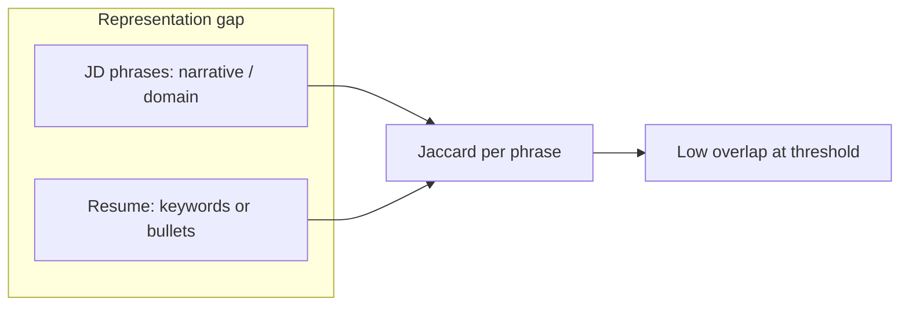

# Improve ATS nodes to catch JD–resume skill mismatches

## What went wrong (from your logs)

| Step                        | Observation                                                                                                                                                                                                                                                                                                                                                                                                                                                                                          |
| --------------------------- | ---------------------------------------------------------------------------------------------------------------------------------------------------------------------------------------------------------------------------------------------------------------------------------------------------------------------------------------------------------------------------------------------------------------------------------------------------------------------------------------------------- |
| **extract_jd_requirements** | `jd_skills` are long phrases copied from prose: `"AI-Native Support Tooling"`, `"automated email responses"`, `"engineering superior service"`, etc. The prompt in `[manager.py](src/agents/prompts/manager.py)` asks for "technical or role-specific skills or tools", but the model still outputs **marketing bullets**, not comparable tokens.                                                                                                                                                    |
| **extract_resume_skills**   | Lists **concrete tech** (Python, FastAPI, …). The prompt today says skills must be explicitly evidenced and **“do not infer unstated abilities”** (`[get_extract_resume_skills_prompt](src/agents/prompts/manager.py)`), which discourages adding **canonical labels for what role bullets imply** (e.g. “AI auto tagging” → AI automation / microservice-style feature work). Those implied capabilities never enter `resume_skills`, so JD phrases like “automated AI microservices” cannot match. |
| **normalize_entities**      | Only lowercases/strips punctuation; it does not bridge **semantic** gaps.                                                                                                                                                                                                                                                                                                                                                                                                                            |
| **match_skills**            | For each JD phrase, computes Jaccard between **token sets** of that phrase vs **each** resume skill string (`[ats_resume_eval_nodes.py](src/agents/nodes/ats_resume_eval_nodes.py)` lines 294–314). Example: JD `{"saas","apis"}` vs resume `"python"` → **0 overlap**. Threshold `[Constants.SKILL_MATCH_JACCARD_THRESHOLD = 0.6](src/utils/constants.py)` never triggers. Result: **0% skills match**, 30/30 "missing".                                                                            |
| **match_experience**        | `jd_experience=0` → branch that sets score **1.0** ([lines 334–335](src/agents/nodes/ats_resume_eval_nodes.py)), so experience always looks perfect when the JD omits years.                                                                                                                                                                                                                                                                                                                         |
| **match_role**              | ~0.67 = 2 of 3 tokens (`sr`, `software`, `engineer`) — plausible if resume titles use "Senior" instead of "Sr".                                                                                                                                                                                                                                                                                                                                                                                      |
| **compute_score**           | `0.5 * skills + 0.3 * exp + 0.2 * role` → **0.5×0 + 0.3×1 + 0.2×0.67 ≈ 0.43**.                                                                                                                                                                                                                                                                                                                                                                                                                       |

So the resume can be a strong substantive match (integrations, AI/agent tooling, data pipelines) while the **pipeline measures phrase overlap**, not fit.

---

## Recommended changes (ordered by impact)

### 1. Resume extraction: infer matchable capabilities from roles (not only explicit skill lines)

**Problem:** Fit is often shown in **what someone built** (bullets, projects), not in a keyword list. If “AI auto tagging” is described as an automated, model-driven feature, that is reasonable evidence for capabilities the JD bundles as “AI microservices” or “automation” — but the pipeline never adds those labels to the resume side. The same applies to **non-tech** resumes: impact may appear as **metrics, programs, and scope** (e.g. “grew region 15% YoY”, “led digital transformation initiative”) rather than a skills section.

**File:** `[src/agents/prompts/manager.py](src/agents/prompts/manager.py)` — `get_extract_resume_skills_prompt()`

- Broaden “skills” to **competencies and tools**: programming languages and software **where relevant**, plus **domain capabilities** evidenced in bullets (e.g. financial modeling, contract negotiation, people leadership, program management) — still as short labels.
- Relax the blanket “do not infer” rule into something like: **do not invent tools or employers not supported by the text**, but **do** add short, standard capability tags when **clearly supported by described work** (e.g. building an ML-powered tagging pipeline → include terms such as ML, classification, automation, or internal tooling as appropriate).
- Optionally split extraction into two lists in schema/state (if you want cleaner UX): `resume_skills_explicit` vs `resume_skills_from_experience` — or keep one merged list used only for matching (simpler).

**Alternative / addition:** Extend `extract_resume_experience` to return **short capability phrases** per role (new field), then merge into normalization — more structured but a larger schema change.

Matching (`match_skills`) should consume the **union** of explicit + inferred labels so JD phrases can hit inferred capabilities.

### 2. Fix JD extraction: atomic, matchable requirements (**tech and non-tech**)

**File:** `[src/agents/prompts/manager.py](src/agents/prompts/manager.py)` — `get_extract_jd_requirements_prompt()`

- Reframe `jd_skills` in the prompt as **role requirements / competencies**, not “technical skills only.” Include, when the JD emphasizes them: **business and functional** terms (e.g. P&L, forecasting, budgeting, KPI ownership, OKRs, stakeholder management, cross-functional initiatives, vendor management, compliance, sales pipeline, growth, marketing channels, operations metrics) — as **short labels**, same as tools.
- Instruct the model explicitly:
  - Each entry must be a **short label** (ideally **1–3 words**, max ~4): tools, platforms, **or domain competencies** grounded in the posting.
  - **Do not** paste full sentences or rhetorical phrases; **map** narrative text to underlying capabilities (tech: integrations/APIs; non-tech: e.g. “owned revenue targets” → revenue ownership, quota, forecasting — only if supported by text).
  - Prefer **concrete** requirements over slogans; drop pure marketing filler.
  - Cap list length (already “up to 30”) with **prioritization**: most **specific and job-relevant** first (whether technical or business).

Optionally extend `[JDRequirementsExtractionOutput](src/agents/state/ats_resume_eval_state.py)` with a second list, e.g. `jd_skills_must_have` vs `jd_skills_nice_to_have`, **only if** you want different weights in scoring — otherwise a single improved list is enough for v1.

### 3. Make `match_skills` robust to phrase-vs-tech mismatch

**File:** `[src/agents/nodes/ats_resume_eval_nodes.py](src/agents/nodes/ats_resume_eval_nodes.py)`

Without adding embeddings (optional below), improve deterministic matching:

- **Resume token bag:** Build `all_resume_tokens = union of _tokenize_skill_tokens(rs) for each resume skill` once per run.
- **Per JD skill:** Consider a match if **any** of:
  - exact normalized string in `resume_set` (existing), or
  - Jaccard vs any resume skill ≥ threshold (existing), or
  - **non-trivial JD tokens** appear in `all_resume_tokens` (e.g. `apis` ↔ something containing `api` — may need light stemming or alias map for `apis`→`api`), or
  - **subset coverage**: e.g. fraction of JD tokens (excluding a **stoplist**) found in `all_resume_tokens` ≥ a second, lower bar.
- **Noise filtering:** Use a **narrow** stoplist for **generic filler** only (e.g. pure hype: “world-class”, “rockstar”) — **not** broad terms that are **valid competencies** in many non-tech roles (e.g. “customer”, “operations”, “growth”, “finance”) or the matcher becomes **biased toward engineering JDs**. Prefer dropping tokens only when they appear as **standalone** fluff, or use IDF-style / JD-frequency heuristics later — avoid one-size-fits-all stripping.
- **Threshold:** Revisit `SKILL_MATCH_JACCARD_THRESHOLD` (0.6 is strict for 3–4 word phrases); consider **0.35–0.5** for phrase-vs-tech, or use the multi-signal approach above and keep threshold moderate.

This directly addresses "misses" where the resume says `LangChain` / `AWS` / `Kafka` but the JD phrase uses different words for the same capability.

### 4. Optional: semantic / embedding pass for residual gaps

If you need quality on highly narrative JDs without perfect extraction:

- Add a node (or post-step inside matching) that embeds each JD skill phrase and the **concatenated resume skills**, **resume summary**, or **full `resume_text`** (better when fit lives in bullets, not the skills list) and marks a JD item "soft matched" if cosine similarity ≥ T.
- This is an **extra LLM/API cost**; use only if deterministic fixes are insufficient.

### 5. Fairness and non-tech balance (scoring + prompts)

**Risk:** A fixed **50% weight on `skills_match_score`** (`[compute_score](src/agents/nodes/ats_resume_eval_nodes.py)`) assumes “skills overlap” is the primary signal. For **non-tech** roles, fit often lives in **experience narrative, impact, and role title alignment** — over-weighting token overlap on `jd_skills` can **systematically under-rate** strong candidates whose resumes use different wording than the JD.

**Directions (choose one or combine):**

- **Rebalance weights** when JD is light on tool-like tokens: e.g. detect “mostly non-tool competencies” from extraction (simple heuristic: count of known tech keywords vs total) and shift weight toward **role + experience**, or cap the skills dimension.
- **Separate dimensions** (larger change): e.g. `technical_alignment` vs `domain_alignment` with JD-dependent weights — only if product needs justify schema growth.
- **Full-text signal for non-tech:** feed **normalized tokens from `resume_text`** (or experience bullets only) into the same token-bag matcher so “KPI”, “EBITDA”, “pipeline” in bullets can match JD requirements without requiring a separate “skills section.”
- **Prompt neutrality:** Keep `[system_json_extraction](src/agents/prompts/manager.py)` explicitly **role-agnostic**: assess **document content only**; do not prefer tech vs non-tech; do not use names, photos, or demographic cues if those ever appear in schema (they should not be extracted for scoring).
- **Explanation node:** Ensure `[get_generate_explanation_prompt](src/agents/prompts/manager.py)` does not **stigmatize** non-tech gaps (e.g. avoid implying “not technical enough” for finance roles).

### 6. Long documents: chunk, analyze, collate

**Problem:** Very long resumes or JDs risk **truncation** in a single LLM call, **lost signal** (requirements buried on page 5), or **cost spikes** from stuffing full text. The graph today passes full `resume_text` / `jd_text` into each extraction node (`[ats_processor_agent.py](src/agents/ats_processor_agent.py)` → nodes in `[ats_resume_eval_nodes.py](src/agents/nodes/ats_resume_eval_nodes.py)`).

**Approach (map → reduce):**

1. **Threshold:** If character or token count (approximate) is below a budget (e.g. safe fraction of model context reserved for prompts + JSON), **skip chunking** — single path unchanged.
2. **Splitting:** Chunk by **token/char budget** with small **overlap** (e.g. 10–15%) so bullets split across boundaries are not lost. Optionally prefer **structure-aware** splits when cheaply detectable (double newlines, “Experience”, “Education”, markdown headings) — falls back to fixed windows.
3. **Map:** Run the **same extraction prompts** per chunk (skills, experience, education, JD requirements) in parallel where possible. Each chunk returns partial lists / partial experience fields.
4. **Collate (reduce) — deterministic first:**
  - **Lists (`resume_skills`, `jd_skills`, `resume_education`):** union + **dedupe** preserving order (reuse `_unique_preserve_order`); cap to max list sizes (e.g. 30) with optional frequency or “first seen in earlier chunk” priority.
  - `**jd_experience`:** `max` across chunks if each chunk outputs a minimum-years signal, or **last non-zero** — document the rule; if chunks are unreliable, prefer a **single final reduce LLM** call with only the collated candidate lists + short snippets.
  - `**jd_role`:** Prefer chunk that contains title-like header, or **majority / first non-empty**, or one **small merge LLM** call: “Given these candidate role strings, output one concise `jd_role`.”
  - `**resume_experience` (`years_total`, `years_relevant`, `titles`):** `years_`* = **max** of chunk estimates (conservative for overlap); `titles` = union deduped, recent-first cap.
5. **Optional second LLM (reduce):** If partial extractions **contradict** or lists are huge, one **merge prompt** takes concatenated chunk outputs (or summaries) and emits a **single** JSON matching existing schema — keeps downstream `normalize_entities` unchanged.
6. **Graph wiring:** New utility module e.g. `[src/utils/text_chunking.py](src/utils/text_chunking.py)` + either:
  - **Pre-node** that replaces `resume_text`/`jd_text` in state with chunk list and routes map-reduce inside wrapper nodes, or
  - **Subgraph** `extract_`* → map over chunks → `collate_resume` / `collate_jd` before `normalize_entities`.
7. **Fairness:** Chunking must not **drop** tail sections (often older roles or legal JD boilerplate with compliance reqs); overlap + union collation mitigates. Avoid biasing toward **first chunk only** for role/title without a merge rule.

**Cost/latency:** Chunking multiplies LLM calls; gate on size, cap max chunks, and parallelize `asyncio.gather` for chunk extractions.

### 7. Smaller fixes (worth including)

- **Role tokens:** In `_tokenize_role`, normalize **Sr ↔ Senior**, **SWE ↔ software engineer** if you want higher role scores when abbreviations differ (`[match_role](src/agents/nodes/ats_resume_eval_nodes.py)`). Extend with common **non-tech** title normalizations if needed (e.g. **VP ↔ Vice President**).
- **Experience when JD has no years:** Instead of always `1.0`, use **neutral** (e.g. `0.5` or omit experience from the blend) or derive a soft signal from resume years only — avoids inflating the final score when the JD is silent.

### 8. Tests

There are **no** current tests for these nodes. Add focused unit tests for `_normalize_skill_name`, `match_skills` (constructed states: narrative JD phrases vs tech resume list, and improved JD list vs same resume), **plus a non-tech fixture** (e.g. finance / strategy JD + resume with KPI and initiative language, no programming stack), **chunking/collation** (synthetic long text split across chunks; assert union/dedupe and stable `jd_role`/`jd_experience` rules), and optionally a golden case from `[examples/samples.json](examples/samples.json)` + your PDF text fixture.

---

## Success criteria

- For the sample JD (AI/support tooling, integrations, APIs, data/agents) and a resume listing **LangChain, LangGraph, FastAPI, integrations, AWS, messaging**, skills score should reflect **partial-to-strong** overlap, not **0.0**.
- Where capability is shown only in **role bullets** (e.g. AI-powered tagging), inferred tags should allow overlap with JD phrases like **automation** / **AI microservices** when evidence is clear — without inventing tools not mentioned.
- Explanation `missing_skills` should list **credible** gaps, not 30 generic phrases.
- Final score should move **monotonically** with obvious resume improvements (add a listed skill that appears in JD).
- For a **non-tech** JD/resume pair, scores and explanations should not collapse solely because **programming keywords** are absent; competency overlap (business, leadership, domain) should contribute meaningfully.
- **Long inputs:** Requirements or skills that appear only in **later** sections of a multi-page JD or resume are still reflected after chunk+merge (no systematic bias toward the first page only).

---

## Additional gaps — LLM analysis flows only

Scoped to **extraction prompts, LLM outputs, matching that consumes them, chunk collation, and `generate_explanation`** — not PDF ingestion, DB, API shell, or general ops.

| Area                                 | Gap                                                                                                                                                                                                                                                                           |
| ------------------------------------ | ----------------------------------------------------------------------------------------------------------------------------------------------------------------------------------------------------------------------------------------------------------------------------- |
| **Extraction coverage**              | `[extract_resume_education](src/agents/nodes/ats_resume_eval_nodes.py)` is LLM-produced but **never consumed** by `compute_score` or downstream matching — education requirements only matter if `extract_jd_requirements` happens to put them in `jd_skills`.                |
| **Extraction inconsistency**         | Same resume wording can yield **different skill lists** across runs or model versions (even with `temperature=0`, minor API variance). No consolidation pass across extractions.                                                                                              |
| **Grounding vs hallucination**       | Models can still emit **skills or JD requirements** not literally present; “ground in text” reduces but does not eliminate this. **Retries / validation** (e.g. reject items with no n-gram overlap with source) are LLM-flow hardening.                                      |
| **Language & prompts**               | Prompts and `[_tokenize_skill_tokens](src/agents/nodes/ats_resume_eval_nodes.py)` assume **English-like** tokens; multilingual or code-mixed text weakens extraction and deterministic matching unless prompts/normalization are extended.                                    |
| **Asymmetry**                        | JD and resume are extracted with **different prompts**; narrative JD vs keyword resume **representation mismatch** can reappear if one side is summarized differently by the model.                                                                                           |
| **Chunking + LLM map-reduce**        | Per-chunk extraction can **split evidence** for one fact across calls; collation is mostly **merge lists**, not a second reasoning pass — edge cases: contradictory `jd_experience` across chunks, **synonym duplication** (“K8s” vs “Kubernetes”) after dedupe.              |
| **Deterministic layer on LLM lists** | `[match_skills](src/agents/nodes/ats_resume_eval_nodes.py)` cannot recover **semantic** equivalence the LLM failed to align. **Keyword stuffing** inflates overlap if matching loosens, without an LLM **credibility** check against bullets.                                 |
| **Calibration of numeric outputs**   | `[compute_score](src/agents/nodes/ats_resume_eval_nodes.py)` uses fixed weights on scores driven by **LLM-derived list length and content** — not **job-normalized**; long `jd_skills` lists mechanically depress `skills_match_score` unless weights or denominators adjust. |
| **Explanation node**                 | `[generate_explanation](src/agents/nodes/ats_resume_eval_nodes.py)` is an LLM **narrative on fixed numbers** — risk of **over-confident** or **misleading** copy vs brittle scores; optional: constrain tone to score bands.                                                  |
| **Fairness in extraction**           | Prompt framing can **over-index** tech terms; non-tech competencies may be **under-extracted** unless prompts balance domains (covered in main plan).                                                                                                                         |

**Explicitly out of scope for this section:** OCR/PDF quality, HTTP timeouts, logging/PII, DB — not gaps *inside* the LLM analysis subgraph.

### Can extra LLM calls fix these?

**Mostly yes** — many gaps map cleanly to **additional LLM steps** (often cheaper/smaller models for verification):

| Gap                             | Typical LLM-based mitigation                                                                            | Non-LLM alternative (often cheaper)                          |
| ------------------------------- | ------------------------------------------------------------------------------------------------------- | ------------------------------------------------------------ |
| Education unused                | One call: “extract degree requirements from JD” + “compare to resume education” → score or binary       | Rule-based keyword match on structured education strings     |
| Inconsistency / chunk collation | **Reduce** pass: merge partial JSON into one canonical schema; resolve conflicts                        | Deterministic union + max() + dedupe only                    |
| Grounding / hallucination       | **Verifier** pass: “for each extracted item, quote a supporting span or mark invalid”                   | Drop items with no character n-gram overlap with source text |
| Language                        | Translate or “normalize to English labels” in a dedicated call                                          | `langdetect` + branch prompts; no translation                |
| Asymmetry / semantic match      | **Alignment** call: map JD requirements ↔ resume evidence in shared vocabulary; or embedding similarity | Improved prompts + deterministic aliases only                |
| Deterministic matcher limits    | **Pairwise** LLM or embedding: “does resume support JD requirement X?”                                  | Embeddings only (no generative)                              |
| Calibration                     | LLM labels requirements as must-have vs nice-to-have, or reweights lists                                | Heuristic denominators, cap JD list length                   |
| Explanation tone                | Already LLM — tighten system prompt with **score bands** and “do not overstate”                         | Template-based explanation from numbers only                 |

**Caveats:** More LLM calls increase **latency, cost, and failure surface**; a verifier is still an LLM and can err — **hybrid** designs (deterministic filter first, LLM only for borderline) are often best. **Compounding hallucination** (model A output validated by model B) needs conservative prompts and spot-checks. Not every gap *should* be solved with more generation — **overlap checks, synonym maps, and math** are preferable when they are sufficient.